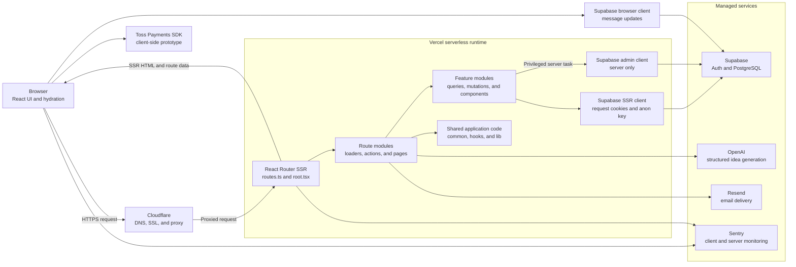

# Architecture

app-lause is a full-stack React Router application organized around feature domains. The architecture is designed to keep routing, data access, UI composition, authentication, and production monitoring understandable as the product grows.

## Goals

- Keep feature code grouped by domain instead of by technical layer only.
- Use typed server loaders and actions for data fetching and mutations.
- Keep Supabase access explicit and type-aware.
- Separate browser-only integrations from server-rendered code paths.
- Make production failures observable without exposing sensitive details to users.

## System Architecture



Most application data flows through typed route loaders and actions running on Vercel. These server paths use the cookie-aware Supabase SSR client so authentication and database access remain connected to the incoming request.

The browser talks directly to external services only where the interaction requires a browser runtime: real-time message updates, the payment prototype, and client-side error reporting. The Supabase service-role client stays inside the server runtime and is reserved for privileged tasks such as storing generated ideas.

## Application Structure

```text
app/
├── common/          # Shared components, UI helpers, homepage
├── features/        # Product domains
├── hooks/           # Shared React hooks
├── lib/             # Shared utility modules
├── sql/             # Database functions, policies, triggers, views, migrations
├── root.tsx         # Root layout, root loader, global error boundary
├── routes.ts        # React Router route configuration
├── supa-client.ts   # Browser and SSR Supabase clients
└── supa-admin.server.ts # Service-role Supabase client for server-only tasks
```

The `features` directory contains domain-specific pages, components, schemas, queries, and mutations. This keeps each area easier to reason about independently.

Current feature areas include:

- `applauses`
- `auth`
- `challenges`
- `community`
- `ideas`
- `teams`
- `users`
- `analytics`

## Routing Model

Routes are declared in `app/routes.ts` using React Router's route configuration API. Pages use route module exports such as `loader`, `action`, and `meta`.

Examples of route groups:

- `/applauses`
- `/applauses/leaderboards`
- `/ideas`
- `/challenges`
- `/auth`
- `/community`
- `/teams`
- `/my/dashboard`
- `/users/:username`

The route structure mirrors the product structure, which makes it easier to connect URL paths to feature modules.

## Data Loading And Mutations

The app uses React Router loaders and actions for server-side data access.

- Loaders fetch data needed to render a route.
- Actions handle mutations such as authentication, form submissions, upvotes, and generated content.
- Shared query and mutation functions live inside feature folders.

This keeps server data dependencies close to route boundaries while keeping database queries reusable.

## Supabase Integration

Supabase is used for authentication and database access.

`app/supa-client.ts` defines:

- A browser client for client-side Supabase usage.
- An SSR client that reads and writes auth cookies through request/response headers.
- A merged `Database` type based on generated Supabase types plus typed views.

`app/supa-admin.server.ts` defines a service-role client for server-only operations that require elevated privileges.

## Database Assets

SQL files are stored under `app/sql` to document and version backend behavior.

```text
app/sql/
├── functions/       # PostgreSQL functions
├── migrations/      # Drizzle-generated migrations and seed data
├── security/        # Row-level security policies
├── triggers/        # Event and notification triggers
└── views/           # Read-optimized database views
```

This makes backend behavior reviewable from the repository instead of living only in a hosted database dashboard.

## Authentication

The app supports:

- Email OTP authentication
- Social OAuth authentication
- Server-side session exchange through Supabase
- Auth-aware root layout state

Social OAuth redirects are generated from the current request origin so local and production environments can share the same route code.

```ts
const baseUrl = new URL(request.url);
const redirectTo = `${baseUrl.origin}/auth/social/${provider}/complete`;
```

## Error Handling And Monitoring

The root error boundary in `app/root.tsx` gives users status-specific messages while reporting meaningful failures to Sentry.

Current strategy:

- `404`: show a not-found message and do not report to Sentry.
- `401` / `403`: show an access message and do not report as a server failure.
- `500+`: show a generic server message and report to Sentry.
- Unexpected JavaScript errors: report to Sentry and show stack details only in development.

Sentry is initialized for both client and server runtime paths.

## Third-Party Runtime Boundaries

Browser-only integrations should not be imported at server module startup. For example, payment SDK loading belongs in client-side effects or browser-only paths so SSR and Vercel serverless startup remain safe.

This reduces the chance of production crashes caused by browser-only packages being evaluated in a Node.js server environment.

## Datetime Strategy

Datetime locale and timezone settings are centralized in `app/lib/datetime.ts`.

This avoids spreading timezone strings throughout route modules and keeps leaderboard date calculations easier to audit.

## Deployment Architecture

Production deployment uses:

- Vercel for builds and serverless runtime
- Cloudflare for DNS, SSL/proxy behavior, and firewall configuration
- Sentry for runtime error monitoring
- Supabase for auth and database services

The `main` branch is treated as the production deployment branch.
